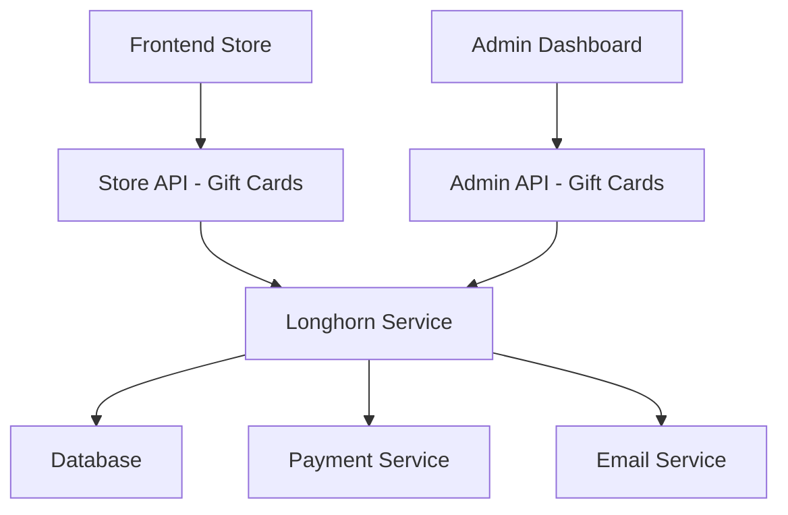

# Estrategia de Compra de Gift Cards - Longhorn

## Resumen Ejecutivo

Este documento define la estrategia completa para implementar el flujo de compra de gift cards desde el frontend, integrando con el sistema existente de Longhorn y proporcionando visibilidad completa en la sección administrativa.

## 1. Arquitectura del Sistema

### 1.1 Componentes Principales



### 1.2 Flujo de Datos

1. **Cliente Frontend** → Selecciona gift card y procede al pago
2. **Store API** → Valida datos y crea orden pendiente
3. **Payment Service** → Procesa el pago
4. **Longhorn Service** → Crea gift card y registra transacciones
5. **Email Service** → Envía gift card al destinatario
6. **Admin Dashboard** → Muestra todas las compras y estadísticas

## 2. Endpoints para Frontend (Store API)

### 2.1 Estructura de URLs

```
POST   /store/longhorn/gift-cards/purchase
GET    /store/longhorn/gift-cards/{code}/validate
POST   /store/longhorn/gift-cards/{code}/redeem
GET    /store/longhorn/gift-cards/purchase-options
```

### 2.2 Endpoint de Compra Principal

**URL:** `POST /store/longhorn/gift-cards/purchase`

**Payload:**
```json
{
  "amount": 100.00,
  "currency": "PEN",
  "recipient_email": "destinatario@email.com",
  "recipient_name": "Juan Pérez",
  "sender_name": "María González",
  "sender_email": "maria@email.com",
  "message": "¡Feliz cumpleaños!",
  "delivery_date": "2025-07-15T18:00:00Z",
  "payment_method": "stripe",
  "customer_info": {
    "first_name": "María",
    "last_name": "González",
    "email": "maria@email.com",
    "phone": "+51987654321"
  }
}
```

**Response:**
```json
{
  "purchase_id": "gc_purchase_123",
  "gift_card": {
    "id": "gc_456",
    "code": "LH-GIFT-2025-ABC123",
    "amount": 100.00,
    "currency": "PEN",
    "expires_at": "2025-12-31T23:59:59Z",
    "status": "active"
  },
  "payment": {
    "status": "completed",
    "payment_intent_id": "pi_stripe_123",
    "amount_paid": 100.00
  },
  "delivery": {
    "status": "scheduled",
    "delivery_date": "2025-07-15T18:00:00Z",
    "recipient_email": "destinatario@email.com"
  }
}
```

### 2.3 Validación de Gift Card

**URL:** `GET /store/longhorn/gift-cards/{code}/validate`

**Response:**
```json
{
  "valid": true,
  "gift_card": {
    "code": "LH-GIFT-2025-ABC123",
    "balance": 75.50,
    "currency": "PEN",
    "is_active": true,
    "expires_at": "2025-12-31T23:59:59Z"
  }
}
```

### 2.4 Redención de Gift Card

**URL:** `POST /store/longhorn/gift-cards/{code}/redeem`

**Payload:**
```json
{
  "amount": 25.00,
  "order_id": "order_789",
  "customer_email": "cliente@email.com"
}
```

## 3. Integración con Sistema de Pagos

### 3.1 Flujo de Pago

1. **Frontend** envía solicitud de compra
2. **Backend** crea `payment_intent` con Stripe/PayU
3. **Frontend** completa el pago con el provider
4. **Webhook** confirma el pago exitoso
5. **Backend** activa la gift card y envía email

### 3.2 Estados de Gift Card

```typescript
enum GiftCardStatus {
  PENDING_PAYMENT = "pending_payment",
  ACTIVE = "active",
  PARTIALLY_USED = "partially_used",
  FULLY_REDEEMED = "fully_redeemed",
  EXPIRED = "expired",
  CANCELLED = "cancelled"
}
```

## 4. Base de Datos - Nuevas Tablas

### 4.1 Tabla: longhorn_gift_card_purchase

```sql
CREATE TABLE longhorn_gift_card_purchase (
  id VARCHAR PRIMARY KEY,
  gift_card_id VARCHAR REFERENCES longhorn_gift_card(id),
  customer_email VARCHAR NOT NULL,
  customer_name VARCHAR NOT NULL,
  customer_phone VARCHAR,
  payment_method VARCHAR NOT NULL,
  payment_intent_id VARCHAR,
  payment_status VARCHAR DEFAULT 'pending',
  purchase_amount DECIMAL(10,2) NOT NULL,
  currency VARCHAR(3) DEFAULT 'PEN',
  metadata JSONB,
  created_at TIMESTAMP DEFAULT NOW(),
  updated_at TIMESTAMP DEFAULT NOW(),
  deleted_at TIMESTAMP NULL
);
```

### 4.2 Extensión de longhorn_gift_card

```sql
-- Agregar nuevos campos para compras online
ALTER TABLE longhorn_gift_card ADD COLUMN purchase_id VARCHAR;
ALTER TABLE longhorn_gift_card ADD COLUMN delivery_date TIMESTAMP;
ALTER TABLE longhorn_gift_card ADD COLUMN sender_email VARCHAR;
ALTER TABLE longhorn_gift_card ADD COLUMN purchase_source VARCHAR DEFAULT 'admin';
```

## 5. APIs Admin - Visibilidad de Compras

### 5.1 Dashboard de Compras

**URL:** `GET /admin/longhorn/gift-cards/purchases`

**Query Parameters:**
- `start_date`: Fecha inicio
- `end_date`: Fecha fin
- `status`: Estado de compra
- `limit` / `offset`: Paginación

**Response:**
```json
{
  "purchases": [
    {
      "id": "gc_purchase_123",
      "gift_card": {
        "code": "LH-GIFT-2025-ABC123",
        "amount": 100.00,
        "status": "active"
      },
      "customer": {
        "name": "María González",
        "email": "maria@email.com"
      },
      "payment": {
        "method": "stripe",
        "status": "completed",
        "amount": 100.00
      },
      "purchased_at": "2025-07-08T10:30:00Z"
    }
  ],
  "total": 1,
  "stats": {
    "total_purchases": 45,
    "total_revenue": 4500.00,
    "pending_deliveries": 3
  }
}
```

### 5.2 Estadísticas de Ventas

**URL:** `GET /admin/longhorn/gift-cards/sales-stats`

**Response:**
```json
{
  "period": "last_30_days",
  "total_sales": 4500.00,
  "total_units": 45,
  "average_value": 100.00,
  "growth_rate": 15.5,
  "by_day": [
    {
      "date": "2025-07-08",
      "sales": 300.00,
      "units": 3
    }
  ],
  "payment_methods": {
    "stripe": 80,
    "paypal": 20
  }
}
```

## 6. Frontend UI - Sección de Compras

### 6.1 Nueva Pestaña en Gift Cards Admin

```
Gift Cards
├── Dashboard (existente)
├── Gestión (existente)
├── Transacciones (existente)
└── Compras Online (NUEVO)
```

### 6.2 Componentes UI Nuevos

1. **Tabla de Compras Online**
   - Lista de todas las compras desde frontend
   - Filtros por fecha, estado, monto
   - Acciones: Ver detalles, reenviar email, cancelar

2. **Dashboard de Ventas**
   - Gráficos de ventas por día/semana/mes
   - Métricas de conversión
   - Top gift cards vendidas

3. **Gestión de Entregas**
   - Gift cards pendientes de envío
   - Programación de entregas
   - Estado de emails enviados

## 7. Servicios de Entrega

### 7.1 Email Service

```typescript
interface EmailDeliveryService {
  sendGiftCard(giftCard: GiftCard, recipient: Recipient): Promise<void>
  scheduleDelivery(giftCard: GiftCard, deliveryDate: Date): Promise<void>
  sendPurchaseConfirmation(purchase: Purchase): Promise<void>
}
```

### 7.2 Templates de Email

1. **Gift Card para Destinatario**
   - Código de gift card
   - Instrucciones de uso
   - Mensaje personalizado del remitente

2. **Confirmación de Compra**
   - Detalles de la compra
   - Información de entrega
   - Recibo de pago

## 8. Plan de Implementación

### Fase 1: Backend Foundation (Semana 1)
- [ ] Crear modelos de compra
- [ ] Implementar endpoints store API
- [ ] Integrar servicio de pagos
- [ ] Testing de endpoints básicos

### Fase 2: Admin Integration (Semana 2)
- [ ] Extender APIs admin para compras
- [ ] Crear componentes UI para compras
- [ ] Implementar dashboard de ventas
- [ ] Testing de integración admin

### Fase 3: Email & Delivery (Semana 3)
- [ ] Servicio de emails
- [ ] Templates responsive
- [ ] Programación de entregas
- [ ] Testing end-to-end

### Fase 4: Frontend Store (Semana 4)
- [ ] Integración con store frontend
- [ ] Flujo de compra completo
- [ ] Testing de usuario final
- [ ] Documentación

## 9. Testing Strategy

### 9.1 Test Cases Críticos

1. **Compra Exitosa**
   - Usuario completa compra → Gift card activa generada
   - Pago procesado → Email enviado automáticamente
   - Datos visibles en admin → Estadísticas actualizadas

2. **Fallo de Pago**
   - Pago falla → Gift card no se crea
   - Usuario recibe error → Admin no ve compra fallida

3. **Redención Parcial**
   - Gift card de S/100 → Uso de S/30
   - Balance actualizado a S/70 → Transacción registrada

### 9.2 Performance Tests

- 100 compras simultáneas
- Validación de códigos únicos
- Integridad de transacciones

## 10. Consideraciones de Seguridad

### 10.1 Validaciones

- Códigos únicos garantizados
- Validación de montos mínimos/máximos
- Rate limiting en endpoints públicos
- Sanitización de inputs

### 10.2 Fraud Prevention

- Validación de tarjetas de crédito
- Detección de patrones sospechosos
- Límites de compra por usuario/día
- Verificación de emails

## 11. Métricas de Éxito

### 11.1 KPIs Técnicos

- Tiempo de respuesta < 2s para compras
- 99.9% uptime de endpoints
- 0% pérdida de transacciones
- Emails entregados en < 5 minutos

### 11.2 KPIs de Negocio

- Incremento del 25% en ventas de gift cards
- Tiempo promedio de compra < 3 minutos
- Satisfacción del cliente > 4.5/5
- Reducción del 50% en soporte manual

---

**Fecha de creación:** 2025-07-08  
**Versión:** 1.0  
**Estado:** Planificación  
**Próxima revisión:** 2025-07-15
